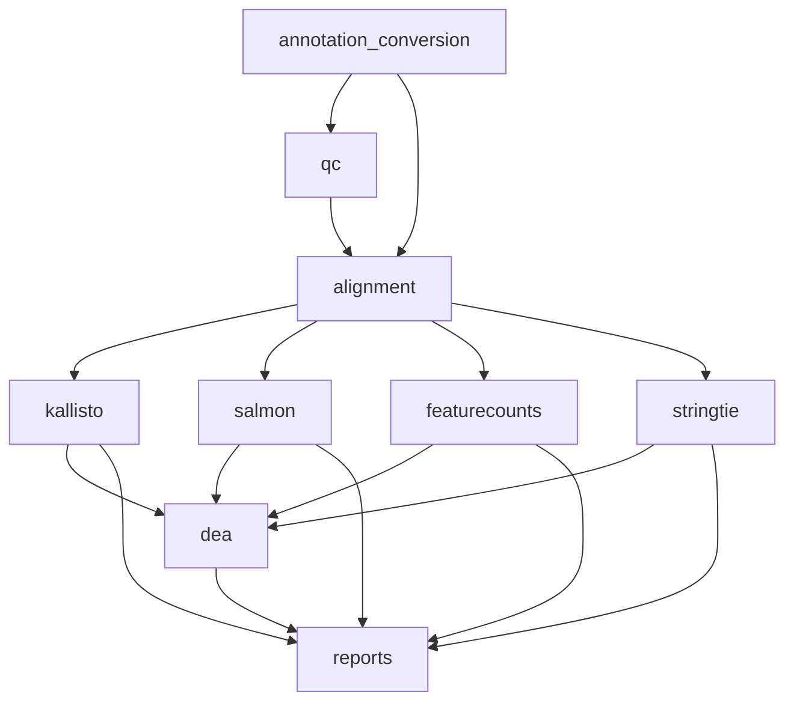

# 🧬 OmniQuant-RNA: 全能型 RNA-seq 转录组定量工作流

这是一个基于Snakemake的全自动化RNA-seq转录组定量分析流水线，集成了多种主流定量方法、完整的质量控制体系、自动化注释转换和模块化运行架构，为转录组学研究提供标准化、可重复的分析解决方案。

## ⭐ 核心优势

### 🔬 **多方法定量支持**
- **Kallisto**: 超高速pseudo-alignment定量，适合大规模样本
- **Salmon**: 精确准比对定量，支持偏置校正和变异检测
- **featureCounts**: 基于比对的基因水平计数，标准可靠
- **StringTie**: 转录本重构和定量，支持新转录本发现

### 🛡️ **全方位质量控制**
- **FastQC**: 原始和处理后数据质量全面评估
- **fastp**: 高效序列修剪和质量过滤
- **MultiQC**: 整合式质控报告，一站式查看所有QC结果
- **比对统计**: 详细的比对率和覆盖度分析

### 🤖 **高度智能化适配**
- **自适应参考文件**: 将任意命名的基因组 (.fasta) 或注释文件 (.gtf/.gff3) 丢入参考目录，自动扫描并接管。
- **自动格式清洗**: 运行前自动扫描并清洗导致兼容性崩溃的长空格 Fasta 序列头，拒绝各种报错。
- **后台脱机运行**: 智能识别非交互式 `nohup` 环境，无需用户按键确认即可自动跑通全程。

### 🔄 **智能注释处理**
- **自动格式检测**: 智能识别GFF3/GTF格式
- **双向转换**: 支持GFF3 ⇌ GTF无损转换
- **转录组提取**: 自动从基因组提取转录本序列
- **索引自动化**: 一键构建所有工具的索引文件

### 🧩 **模块化架构**
- **独立运行**: 每个分析步骤可单独执行
- **灵活组合**: 根据需求选择性运行特定模块
- **依赖管理**: 智能处理模块间依赖关系
- **断点续跑**: 支持从任意步骤重新开始

### 🎯 **标准化输出**
- **统一目录**: 01-06数字编号的标准化结果组织
- **标准格式**: 兼容下游分析的标准文件格式
- **汇总矩阵**: 自动生成各种定量方法的表达矩阵
- **详细报告**: HTML格式的综合分析报告

## 📁 项目完整结构

```
OmniQuant-RNA/
├── README.md                          # 📖 项目说明文档
├── Snakefile                         # 🐍 主工作流文件
│
├── config/                           # ⚙️  配置文件目录
│   └── config.yaml                   #     主配置文件
│
├── data/                             # 📊 数据存储目录
│   ├── fastq/                        #     原始FASTQ文件存放
│   │   ├── samples.tsv               #     样本信息表
│   │   ├── {sample}_R1.fastq.gz      #     正向读长文件
│   │   └── {sample}_R2.fastq.gz      #     反向读长文件
│   └── reference/                    #     参考文件目录
│       ├── genome.fasta              #     参考基因组序列
│       ├── genome.gff3               #     GFF3格式注释
│       ├── genome.gtf                #     GTF格式注释(自动转换)
│       ├── transcriptome.fasta       #     转录组序列(自动提取)
│       ├── kallisto_index/           #     Kallisto索引目录
│       ├── salmon_index/             #     Salmon索引目录
│       └── hisat2_index/             #     HISAT2索引目录
│
├── workflow/                         # 🔄 工作流规则目录
│   ├── rules/                        #     模块化规则文件
│   │   ├── annotation_conversion.smk  #     注释转换规则
│   │   ├── qc.smk                    #     质量控制规则
│   │   ├── alignment.smk             #     序列比对规则
│   │   ├── quantification_kallisto.smk #   Kallisto定量规则
│   │   ├── quantification_salmon.smk   #   Salmon定量规则
│   │   ├── quantification_featurecounts.smk # featureCounts规则
│   │   ├── quantification_stringtie.smk #  StringTie定量规则
│   │   └── report.smk                #     报告生成规则
│   │
│   ├── qc_only.smk                   #     质控独立工作流
│   ├── alignment_only.smk            #     比对独立工作流
│   ├── annotation_conversion_only.smk #     注释转换独立工作流
│   ├── quantification_only.smk       #     定量分析独立工作流
│   ├── quantification_kallisto_only.smk #  Kallisto独立工作流
│   ├── quantification_salmon_only.smk   #  Salmon独立工作流
│   ├── quantification_featurecounts_only.smk # featureCounts独立工作流
│   └── quantification_stringtie_only.smk #  StringTie独立工作流
│
├── workflow/scripts/                 # 🐍 Python分析脚本
│   ├── aggregate_kallisto.py         #     Kallisto结果汇总脚本
│   ├── aggregate_salmon.py           #     Salmon结果汇总脚本
│   ├── aggregate_featurecounts.py    #     featureCounts结果汇总脚本
│   ├── aggregate_stringtie.py        #     StringTie结果汇总脚本
│   └── generate_samples.py           #     样本文件自动生成脚本
│
├── envs/                             # 🐍 Conda环境配置
│   ├── qc.yaml                       #     质量控制环境
│   ├── alignment.yaml                #     序列比对环境
│   ├── quantification.yaml           #     定量分析环境
│   ├── featurecounts.yaml            #     featureCounts专用环境
│   └── stringtie.yaml               #     StringTie专用环境
│
├── logs/                             # 📝 运行日志目录
│   ├── {rule_name}/                  #     各规则的详细日志
│   └── snakemake.log                 #     Snakemake主日志
│
├── results/                          # 📈 分析结果目录
│   ├── 01.raw_qc/                    #     原始数据质控结果
│   ├── 02.trimmed_data/              #     数据修剪和质控
│   ├── 03.alignment/                 #     序列比对结果  
│   ├── 04.quantification/            #     转录组定量结果
│   │   ├── kallisto/                 #     Kallisto定量输出
│   │   ├── salmon/                   #     Salmon定量输出
│   │   ├── featurecounts/            #     featureCounts定量输出
│   │   └── stringtie/                #     StringTie定量输出
│   ├── 05.differential_expression/                       #     差异表达分析结果 (新)
│   │   ├── featurecounts/            #     基于featurecounts的DEA
│   │   ├── kallisto/                 #     基于kallisto的DEA
│   │   ├── salmon/                   #     基于salmon的DEA
│   │   └── stringtie/                #     基于stringtie的DEA
│   └── 07.reports/                   #     最终报告和汇总
│
├── run_analysis.sh                   # 🚀 完整分析一键运行脚本
├── run_modular.sh                    # 🔧 模块化运行脚本
└── run_annotation_conversion.sh      # 📝 注释转换专用脚本
```

## 🚀 快速开始指南

### 前置要求

```bash
# 系统要求
- Linux/macOS 操作系统
- Python 3.7+
- Conda/Mamba 包管理器
- 充足的磁盘空间 (建议 >100GB)

# 安装Conda (如果未安装)
wget https://repo.anaconda.com/miniconda/Miniconda3-latest-Linux-x86_64.sh
bash Miniconda3-latest-Linux-x86_64.sh

# 安装Snakemake
conda install -c bioconda -c conda-forge snakemake
```

### 1. 项目部署

```bash
# 克隆或下载项目
cd /path/to/your/workspace
git clone <repository_url> OmniQuant-RNA
cd OmniQuant-RNA

# 验证项目结构
tree -L 2

# 创建必要目录(如果不存在)
mkdir -p data/fastq data/reference logs results
```

### 2. 数据准备

```bash
# 将原始FASTQ文件放入指定目录
cp /path/to/your/*.fastq.gz data/fastq/

# 准备参考基因组和注释文件 (支持任意原始命名，系统自动识别挂载，一键接入！)
cp /path/to/NCBI_download/GCF_000001405.39_GRCh38_genomic.fna data/reference/
cp /path/to/Ensembl_download/Homo_sapiens.GRCh38.109.gtf data/reference/

# 验证文件完整性（请确保 data/reference 内只存在一对基因组和注释文件即可）
ls -la data/fastq/
ls -la data/reference/
```

### 3. 配置文件设置

#### 编辑样本信息 (`data/fastq/samples.tsv`)

```bash
# 自动生成样本文件(推荐)
python workflow/scripts/generate_samples.py ./data/fastq/ -o data/fastq/samples.tsv

# 或手动编辑
nano data/fastq/samples.tsv
```

样本文件格式（需包含双端测序数据路径及DEA分组信息）：
```tsv
sample	fq1	fq2	group
Control-1	/path/to/data/Control-1_R1.fastq.gz	/path/to/data/Control-1_R2.fastq.gz	Control
Control-2	/path/to/data/Control-2_R1.fastq.gz	/path/to/data/Control-2_R2.fastq.gz	Control
Treatment-1	/path/to/data/Treatment-1_R1.fastq.gz	/path/to/data/Treatment-1_R2.fastq.gz	Treatment
Treatment-2	/path/to/data/Treatment-2_R1.fastq.gz	/path/to/data/Treatment-2_R2.fastq.gz	Treatment
```

#### 编辑主配置文件 (`config/config.yaml`)

```yaml
# 样本信息文件
samples: "data/fastq/samples.tsv"
samples_path: "data/fastq"
read_length: 150 # average read length

# 参考文件路径配置
reference:
  genome: "data/reference/genome.fasta"
  gff3: "data/reference/genome.gff3"
  gtf: "data/reference/genome.gtf"
  transcriptome: "data/reference/transcriptome.fasta"

# 计算资源配置
medium:
  t: 32  # 任务线程数
  mem_mb: 256000  # 内存限制(MB)

# 工具特定参数
kallisto:
  bootstrap: 100         # bootstrap次数
  extra: ""

salmon:
  extra: "--validateMappings --gcBias --seqBias"  # 偏置校正参数

featurecounts:
  extra: "-p -B -C"      # 双端测序参数
  feature_type: "exon"    # 特征类型
  attribute: "auto"       # 基因层级属性，自动识别 gene_id/gene_name/Parent
  transcript_attribute: "auto"  # 转录本层级属性，自动识别 transcript_id/ID/Parent
  exon_attribute: "auto"  # exon 层级属性，自动识别 exon_id/ID/Parent/gene_id/transcript_id

stringtie:
  extra: "-e -B"         # 基本参数
  merge_extra: "-c 0.5 -T 150"  # 合并参数

# 差异表达分析 (DEA) 参数 (新增)
dea:
  methods: ["deseq2", "edger", "limma"]  # 启用哪些方法
  comparisons: "all"  # 或指定如 ["Treatment_vs_Control"]
  batch_column: null  # 如有批次效应，指定列名
  fdr_threshold: 0.05
  lfc_threshold: 1.0
  min_count: 10
  min_methods: 3      # 联合筛选标准的最小通过方法数
```

### 4. 运行分析

#### 完整流程运行

```bash
# 方法1: 使用一键脚本(推荐)
./run_analysis.sh

# 方法2: 直接使用Snakemake
snakemake --use-conda --cores 16 --rerun-incomplete

# 方法3: 后台运行(适合长时间任务，脚本已进行环境自适应，运行且不会被输入打断)
nohup ./run_analysis.sh > analysis.log 2>&1 &
```

#### 干运行检查

```bash
# 检查工作流完整性
snakemake --dryrun

# 查看将要运行的任务
snakemake --dryrun --quiet

# 生成DAG图
snakemake --dag | dot -Tpng > workflow_dag.png
snakemake --rulegraph | dot -Tpng > rules_graph.png
```

## 🛠️ 模块化使用详解

### 使用模块化脚本

```bash
# 查看帮助信息
./run_modular.sh --help

# 查看可用模块列表
./run_modular.sh --list

# 运行特定模块
./run_modular.sh <module_name> [options]
```

### 各模块详细说明

#### 1. 注释转换模块
```bash
# 仅进行注释格式转换和转录组提取
./run_annotation_conversion.sh

# 或使用模块脚本
./run_modular.sh annotation_conversion --cores 8

# 直接使用Snakemake
snakemake -s workflow/annotation_conversion_only.smk --use-conda --cores 8
```

**输出文件**:
- `data/reference/genome.gtf` - 转换后的GTF格式注释
- `data/reference/transcriptome.fasta` - 提取的转录组序列
- `data/reference/{tool}_index/` - 各工具索引目录

#### 2. 质量控制模块
```bash
# 运行质量控制流程
./run_modular.sh qc --cores 12

# 直接运行
snakemake -s workflow/qc_only.smk --use-conda --cores 12
```

**主要步骤**:
- 原始数据FastQC质控
- fastp序列修剪和过滤
- 修剪后数据质控
- MultiQC综合报告生成

#### 3. 序列比对模块
```bash
# 运行序列比对(需要先完成QC)
./run_modular.sh alignment --cores 16

# 直接运行
snakemake -s workflow/alignment_only.smk --use-conda --cores 16
```

**主要步骤**:
- HISAT2基因组比对
- BAM文件排序和索引
- 比对统计信息生成

#### 4. 定量分析模块

##### 运行所有定量方法
```bash
# 运行全部定量方法
./run_modular.sh quantification --cores 20

# 直接运行
snakemake -s workflow/quantification_only.smk --use-conda --cores 20
```

##### 运行特定定量方法

**Kallisto定量**:
```bash
./run_modular.sh kallisto --cores 16
snakemake -s workflow/quantification_kallisto_only.smk --use-conda --cores 16
```

**Salmon定量**:
```bash
./run_modular.sh salmon --cores 16
snakemake -s workflow/quantification_salmon_only.smk --use-conda --cores 16
```

**featureCounts定量**:
```bash
./run_modular.sh featurecounts --cores 12
snakemake -s workflow/quantification_featurecounts_only.smk --use-conda --cores 12
```

**StringTie定量**:
```bash
./run_modular.sh stringtie --cores 16
snakemake -s workflow/quantification_stringtie_only.smk --use-conda --cores 16
```

#### 5. 差异表达分析 (DEA) 模块
```bash
# 运行差异表达分析流程 (支持 DESeq2, edgeR, limma)
./run_modular.sh dea --cores 16

# 直接运行 (若已有dea专门的独立smk，可类似下面执行，未单独分离时请通过完整流或指定rule名)
# 通常通过指定规则运行:
snakemake run_dea --use-conda --cores 16
```

**主要步骤**:
- 读取定量矩阵并格式化
- 针对选定组进行各种算法的差异表达分析（DESeq2, edgeR, limma等）
- 整合差异基因结果，获取高置信DEGs并生成可视化图表 (Volcano, Venn, Heatmap, PCA等)

#### 6. 完整流程模块
```bash
# 运行完整分析流程
./run_modular.sh all --cores 24


# 带详细输出
./run_modular.sh all --cores 24 --verbose

# 强制重新运行
./run_modular.sh all --cores 24 --force
```

### 模块依赖关系



## 📊 输出结果详细说明

### 结果目录结构

```
results/
├── 01.raw_qc/                          # 原始数据质量控制
├── 02.trimmed_data/                    # 修剪数据和质控
├── 03.alignment/                       # 序列比对结果  
├── 04.quantification/                  # 定量分析结果
├── 05.differential_expression/                             # 差异表达分析结果
└── 07.reports/                         # 报告和汇总
```

### 各目录详细内容

#### 1. 原始数据质控 (`01.raw_qc/`)

```
01.raw_qc/
├── {sample}_R1_fastqc.html             # R1质量报告
├── {sample}_R1_fastqc.zip              # R1详细数据
├── {sample}_R2_fastqc.html             # R2质量报告
├── {sample}_R2_fastqc.zip              # R2详细数据
└── multiqc_report.html                 # 综合质控报告
```

**关键指标**:
- 序列质量分布
- GC含量分析
- 序列长度分布
- 重复序列检测
- 接头污染检测

#### 2. 修剪数据和质控 (`02.trimmed_data/`)

```
02.trimmed_data/
├── {sample}_R1_trimmed.fastq.gz        # 修剪后R1序列
├── {sample}_R2_trimmed.fastq.gz        # 修剪后R2序列
├── {sample}.fastp.html                 # fastp修剪报告
├── {sample}.fastp.json                 # fastp结果数据
├── {sample}_R1_trimmed_fastqc.html     # 修剪后R1质量报告
├── {sample}_R2_trimmed_fastqc.html     # 修剪后R2质量报告
└── trimmed_multiqc_report.html         # 修剪后综合报告
```

**fastp统计信息**:
- 修剪前后读数统计
- 质量分数改善
- 接头移除统计
- N碱基处理统计

#### 3. 序列比对结果 (`03.alignment/`)

```
03.alignment/
└── {sample}/
    ├── Aligned.sortedByCoord.out.bam   # 排序BAM文件
    ├── Aligned.sortedByCoord.out.bam.bai # BAM索引文件
    ├── Log.final.out                   # 最终比对统计
    ├── Log.out                         # 运行日志
    ├── Log.progress.out                # 进度日志
    └── SJ.out.tab                      # 剪接位点信息
```

**比对统计指标**:
- 总读数数量
- 唯一比对读数
- 多位置比对读数
- 未比对读数
- 比对率百分比

#### 4. 定量分析结果 (`04.quantification/`)

##### Kallisto结果 (`kallisto/`)

```
kallisto/
├── {sample}/
│   ├── abundance.tsv                   # 转录本丰度表
│   ├── abundance.h5                    # HDF5格式数据
│   └── run_info.json                   # 运行信息
├── all_samples_tpm.tsv                 # 所有样本TPM矩阵
├── all_samples_counts.tsv              # 所有样本计数矩阵
└── kallisto_summary.txt                # Kallisto汇总统计
```

**abundance.tsv格式**:
```
target_id       length  eff_length      est_counts      tpm
transcript1     1500    1350.5          245.67          8.92
transcript2     2000    1850.2          156.23          4.15
...
```

##### Salmon结果 (`salmon/`)

```
salmon/
├── {sample}/
│   ├── quant.sf                        # 定量结果文件
│   ├── aux_info/                       # 辅助信息目录
│   │   ├── meta_info.json              # 元信息
│   │   ├── fld.gz                      # 片段长度分布
│   │   └── observed_bias.gz            # 观察到的偏置
│   └── logs/                           # 日志目录
├── all_samples_tpm.tsv                 # 所有样本TPM矩阵
├── all_samples_counts.tsv              # 所有样本计数矩阵
└── salmon_summary.txt                  # Salmon汇总统计
```

**quant.sf格式**:
```
Name            Length  EffectiveLength TPM     NumReads
transcript1     1500    1350.45         8.92    245.67
transcript2     2000    1850.23         4.15    156.23
...
```

##### featureCounts结果 (`featurecounts/`)

```
featurecounts/
├── {sample}/
│   ├── counts.txt                      # 基因计数结果
│   └── counts.txt.summary              # 计数汇总统计
├── all_samples_counts.txt              # 合并的计数矩阵
└── featurecounts_summary.txt           # featureCounts汇总
```

**counts.txt格式**:
```
Geneid          Chr     Start   End     Strand  Length  {sample}
gene1           chr1    1000    2500    +       1500    245
gene2           chr1    3000    5000    -       2000    156
...
```

##### StringTie结果 (`stringtie/`)

```
stringtie/
├── {sample}/
│   ├── transcripts.gtf                 # 转录本GTF文件
│   ├── gene_abundances.tab            # 基因丰度表
│   └── transcript_abundances.tab      # 转录本丰度表
├── merged.gtf                          # 合并的转录本文件
├── all_samples_gene_tpm.tsv           # 基因水平TPM矩阵
├── all_samples_transcript_tpm.tsv     # 转录本水平TPM矩阵
└── stringtie_summary.txt              # StringTie汇总统计
```

#### 5. 差异表达分析结果 (`05.differential_expression/`)

```
05.differential_expression/
├── {quantification_tool}/              # 取决于上游定量结果 (如 featurecounts)
│   ├── deseq2.{comp_name}.csv          # DESeq2差异计算结果
│   ├── edger.{comp_name}.csv           # edgeR差异计算结果
│   ├── limma.{comp_name}.csv           # limma差异计算结果
│   ├── normalized_counts.csv           # 归一化后的表达矩阵
│   └── integration/                    # 整合及可视化分析
│       ├── Combined_Results_{comp_name}.csv   # 多方法整合结果
│       ├── DE_genes_{comp_name}_*.csv         # 具体使用的过滤基因
│       ├── HighConfidence_DEGs_{comp}.txt     # 满足多重交叉验证的高置信基因列表
│       ├── Volcano_{comp_name}_*.pdf          # 火山图
│       ├── Venn_{comp_name}.pdf               # 维恩图
│       ├── Heatmap_{comp_name}.pdf            # 差异基因热图
│       ├── PCA_plot.pdf                       # 样本主成分分析图
│       └── Sample_Correlation.pdf             # 样本相关性矩阵图
```

**HighConfidence_DEGs_{comp}.txt 内容**:
满足 config 中 `min_methods` 配置个数的各组差显基因标识符。

#### 6. 报告和汇总 (`07.reports/`)

```
07.reports/
├── multiqc_report.html                 # 综合质控报告
├── sample_summary.tsv                  # 样本统计汇总
├── quantification_summary.html        # 定量结果汇总报告
├── final_report.html                   # 最终综合分析报告
└── workflow_info.txt                   # 工作流运行信息
```

**sample_summary.tsv格式**:
```
sample          raw_reads       trimmed_reads   mapped_reads    mapping_rate
Control-1       5000000         4850000         4650000         95.9%
Control-2       5200000         5050000         4820000         95.4%
...
```


---

*最后更新: 2025年8月10日*  
*版本: v1.0.0*  
*README.md 由 Clude Sonnet 4 生成*
