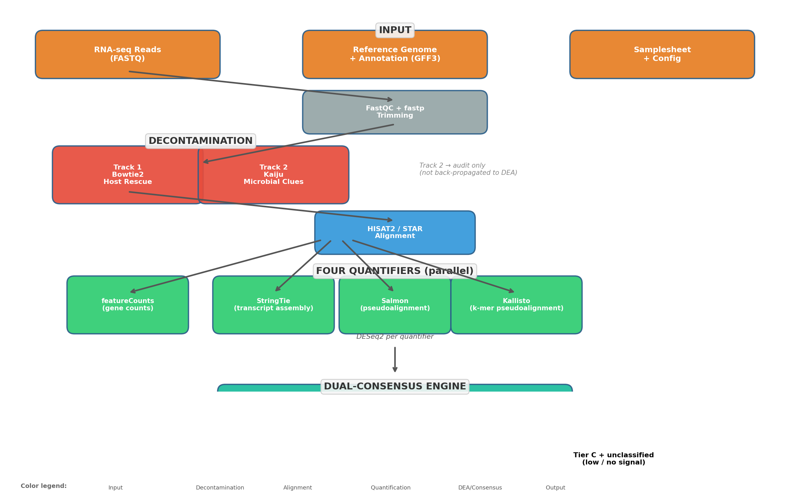
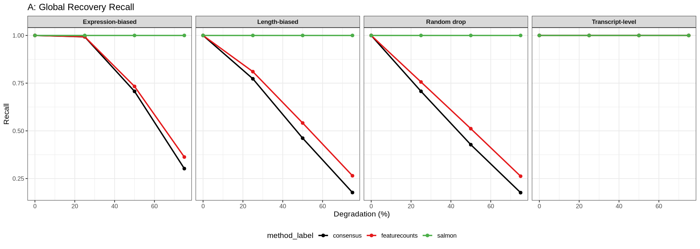
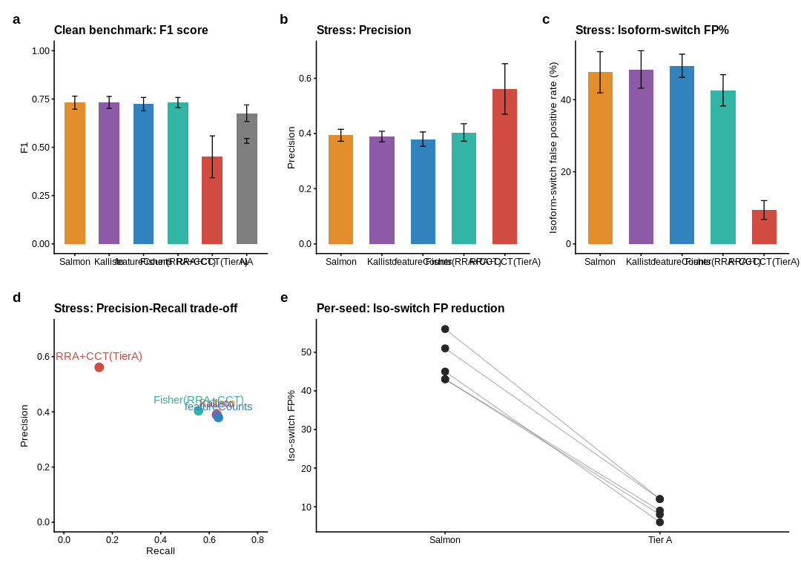
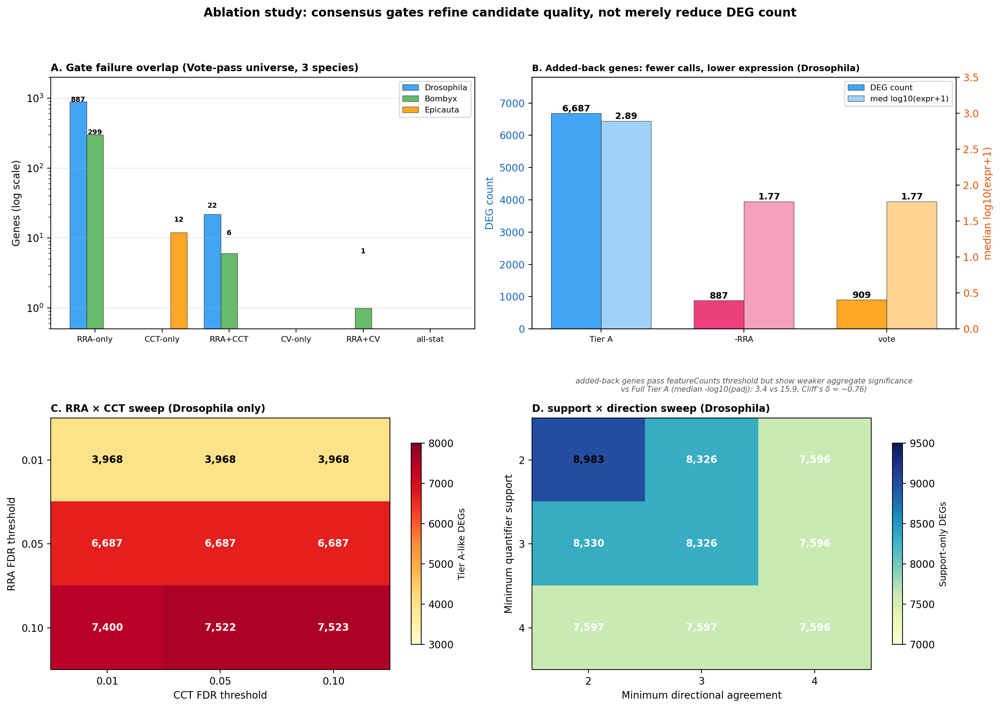
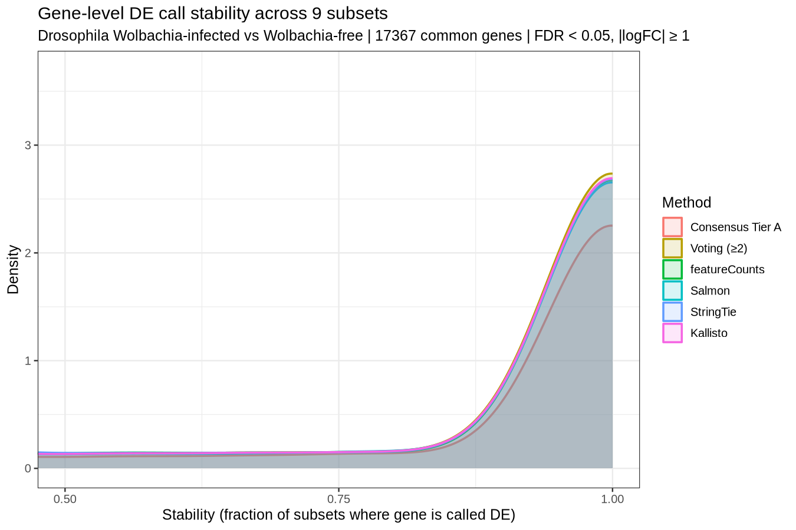
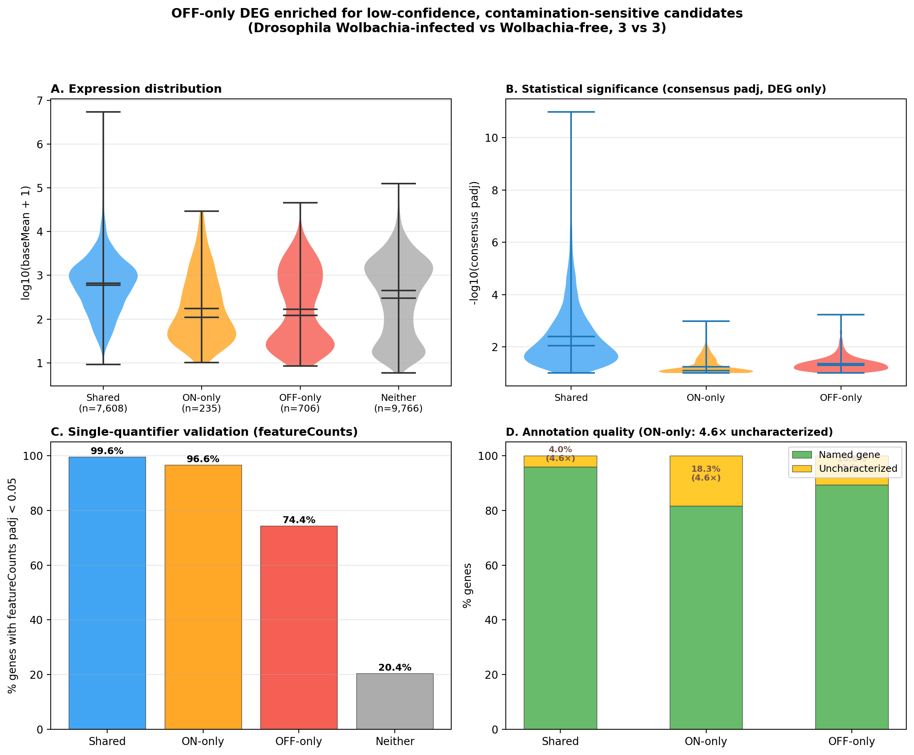
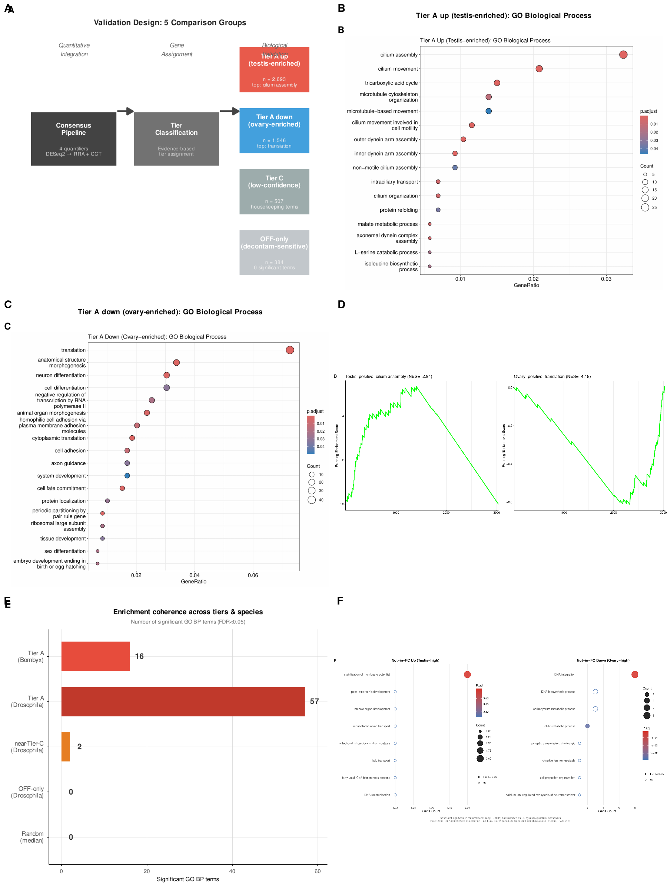
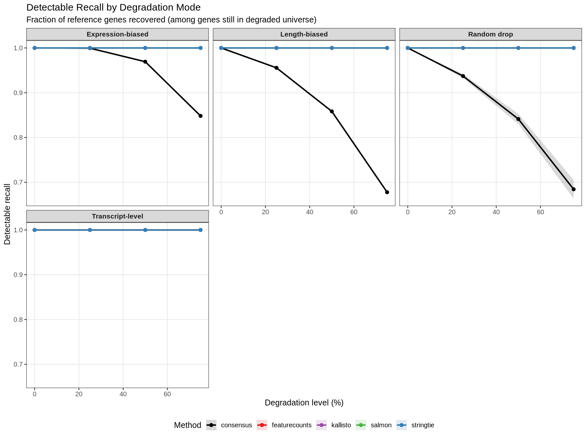
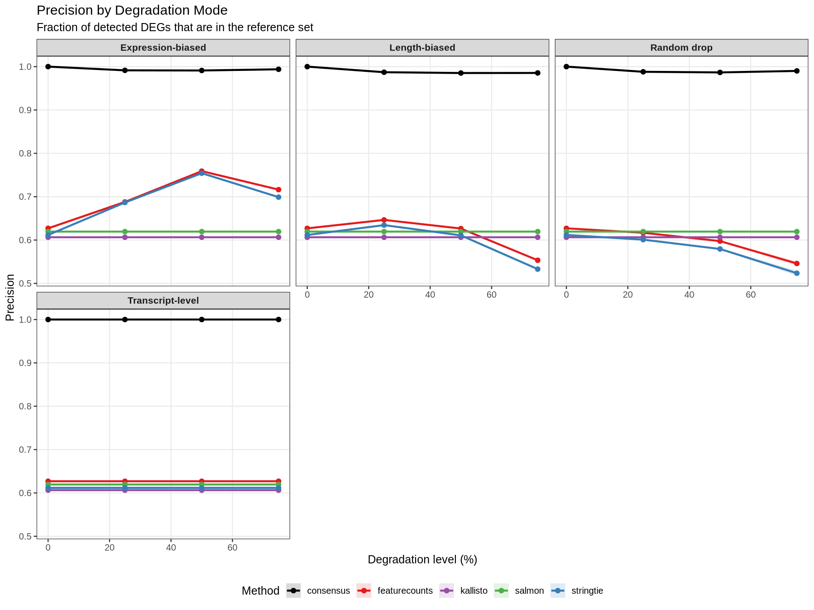
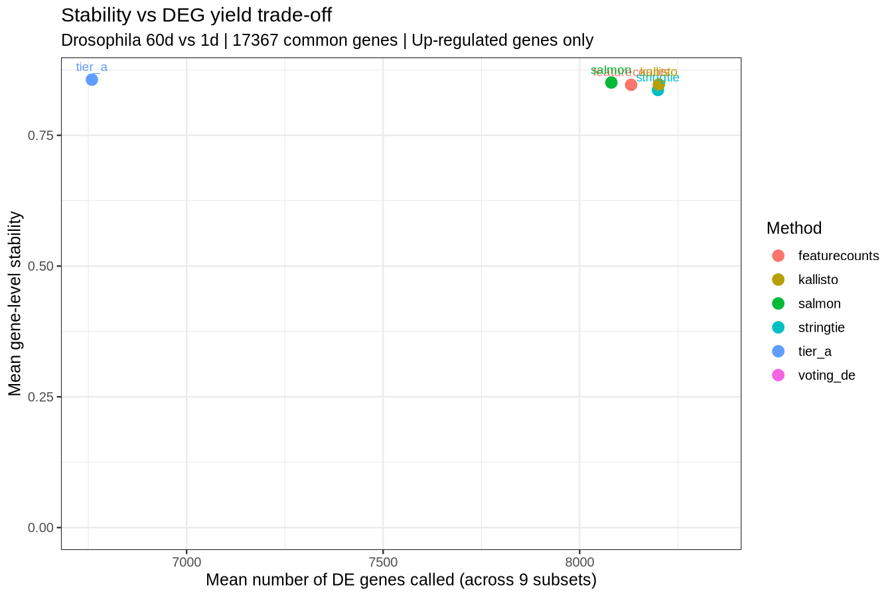

# OmniQuant-RNA: a multi-quantifier consensus framework for robust differential expression analysis under annotation degradation and microbial contamination

---

## Abstract

**Background.** Non-model insect transcriptomics faces three compounding challenges: incomplete genome annotations, pervasive endosymbiont contamination, and the absence of external validation by qPCR or orthogonal assays. Existing RNA-seq analysis pipelines are designed for model organisms with well-annotated genomes and sterile laboratory conditions, leaving non-model studies vulnerable to both annotation-driven false negatives and contamination-driven false positives.

**Results.** We present OmniQuant-RNA, a Snakemake-based workflow that parallelizes four quantifiers (featureCounts, StringTie, Salmon, Kallisto) and integrates their differential expression results through a dual-consensus engine combining Robust Rank Aggregation (RRA) and the Cauchy Combination Test (CCT). Genes are classified into three evidence tiers based on multi-quantifier support, directional consistency, and effect-size stability. In systematic benchmarks on *Drosophila melanogaster* (Wolbachia-infected vs. Wolbachia-free, n = 3 per group), the consensus engine achieved concordance of 0.985 to 1.000 with the reference-condition DEG set, substantially exceeding the best single quantifier (featureCounts: 0.598 to 0.759), and yielded higher F1 scores across all four degradation modes (ΔF1 +0.046 to +0.229). Under expression-biased degradation, the most realistic non-model scenario, consensus detectable recall reached 0.969 at 50% gene loss. Under the most challenging random gene dropout, global recall (0.428) fell below featureCounts (0.511), consistent with the stringency of dual-gatekeeping. The optional decontamination module preserved 96.5% of Tier A genes (Jaccard = 0.882) in *Drosophila* while intercepting 706 candidate false positives (3.0× asymmetry), with negligible distortion of expression estimates (logFC Pearson r = 0.988). Cross-species validation on *Bombyx mori* (r = 0.992, 95.9% retention, 4.0× asymmetry) and *Epicauta impressicornis* (r = 0.957, 89.6% retention, 2.3× asymmetry) indicated that the decontamination signature (high logFC preservation, asymmetric DEG interception, and 100% directional concordance) generalizes across three insect orders. These span a 200-fold range of gene universe sizes and a gradient of annotation quality from well-curated to AUGUSTUS-predicted. Tier threshold sensitivity analysis confirmed that 84.4% of unclassified genes showed no differential signal in any quantifier; individual gate removal produced bounded effects on tier membership. A case study on *Bombyx mori* (testis vs. ovary, 18,210-gene universe) with paired decontamination on/off runs identified 4,239 Tier A genes (23.3%) with full cross-quantifier ID resolution and validated the decontamination module's negligible expression distortion (logFC r = 0.992) and 95.85% Tier A retention across a second insect orders. GO and KEGG enrichment analysis of the *Bombyx mori* testis-ovary consensus results demonstrated that Tier A genes are functionally coherent (spermatogenesis: cilium assembly, FDR 10⁻¹¹; oogenesis: ribosome, FDR 10⁻¹⁴), while Tier C genes lacked pathway-level organization. Notably, all Tier A genes were significant in featureCounts (max adj.P = 0.011), confirming that the consensus engine refines single-quantifier results through multi-quantifier validation rather than expanding the DEG universe, and that its primary value lies in filtering low-confidence candidates rather than discovering genes missed by individual methods.

**Availability.** OmniQuant-RNA is freely available at [repository URL], implemented in Snakemake with Conda-isolated environments. All benchmark data and analysis scripts are included.

---

## Introduction

The decreasing cost of high-throughput sequencing has driven an expansion of transcriptomic studies in insects beyond traditional model species, from agricultural pests to pollinators to disease vectors (Oppenheim et al., 2015; Morandin et al., 2018). These organisms are frequently studied under field-realistic conditions (wild-collected samples, variable rearing environments, and natural microbiome loads), yielding transcriptomes that differ fundamentally from the sterile, inbred laboratory datasets for which most bioinformatics tools were originally developed.

Three challenges are particularly acute for non-model insect transcriptomics. **First, annotation incompleteness.** Insect genomes outside the *Drosophila* clade frequently lack the gene model depth of well-annotated references. Missing isoforms, unannotated tissue-specific genes, and incomplete UTR definitions create systematic biases that affect quantification tools differently depending on whether they rely on genome alignment (featureCounts, StringTie) or transcriptome pseudoalignment (Salmon, Kallisto) (Everaert et al., 2017; Sarantopoulou et al., 2021). **Second, microbial contamination.** Endosymbiotic bacteria (e.g., *Wolbachia*, *Buchnera*, *Wigglesworthia*) are present in an estimated 40–66% of insect species (Hilgenboecker et al., 2008; Zug & Hammerstein, 2012), and their transcripts can constitute a substantial fraction of RNA-seq libraries (Kumar et al., 2022). Without explicit decontamination, microbial reads inflate effective library sizes, distort normalization, and generate spurious differential expression calls. **Third, absence of external validation.** Unlike clinical or model-organism studies where qPCR or orthogonal assays can verify DEG calls, non-model insect studies rarely have independent confirmation, placing the full burden of reliability on the computational pipeline itself.

Existing production-grade RNA-seq workflows, such as nf-core/rnaseq (Ewels et al., 2020), provide multi-quantifier quantification but stop at individual-tool differential expression; they do not integrate results across quantifiers into a consensus call set. While rank-aggregation meta-analysis tools exist (Kolde et al., 2012), they operate on pre-computed lists and are not integrated into an automated pipeline that handles the full journey from raw FASTQ to consensus DEGs, including decontamination.

Multi-quantifier consensus is motivated by a simple observation: different quantifiers depend on annotation quality in structurally different ways, and their systematic errors are unlikely to be correlated. A gene whose differential expression signal survives independent quantification by alignment-based (featureCounts, StringTie) and k-mer-based (Salmon, Kallisto) methods is more likely to represent genuine biology than one detected by a single tool. This principle has been exploited in rank-aggregation meta-analysis (Kolde et al., 2012), but existing implementations do not address the correlation structure among quantifiers. Salmon and Kallisto, sharing algorithmic ancestry, produce correlated P-values that can inflate standard rank aggregation. The Cauchy Combination Test (Liu & Xie, 2020) provides a parametric combination framework that is mathematically robust to arbitrary correlation structures, offering a principled complement to rank-based aggregation.

Here we present OmniQuant-RNA, a complete Snakemake workflow (Mölder et al., 2021) that (i) parallelizes four quantifiers with a unified gene namespace; (ii) implements a consensus engine combining RRA as the primary statistical gate with the correlation-robust CCT as a complementary confirmation layer; (iii) provides an optional decontamination module with a decoupled microbial clue sidecar; and (iv) classifies genes into three evidence tiers. We systematically benchmark OmniQuant-RNA against individual quantifiers under four annotation degradation modes, evaluate the decontamination module through paired on/off pipeline runs, and demonstrate applicability on a silkworm (*Bombyx mori*) dataset.

---

## Methods

### Pipeline Architecture

OmniQuant-RNA is implemented as a Snakemake workflow (Mölder et al., 2021) with per-module Conda environments. The pipeline proceeds through eight stages: (1) reference preparation and gene namespace construction; (2) quality control with FastQC (v0.12.1) and fastp (v0.23.4) trimming; (3) optional decontamination via Bowtie2 (v2.5.5) host-rescue alignment and Kaiju (v1.9.0) classification; (4) read alignment with HISAT2 (v2.2.1, default) or STAR; (5) parallel quantification by featureCounts (v2.0.6), StringTie (v2.2.1), Salmon (v1.10.2), and Kallisto (v0.50.1); (6) single-quantifier differential expression analysis with DESeq2 (v1.42.0); (7) multi-quantifier consensus integration; and (8) MultiQC (v1.21) report aggregation. A unified tx2gene namespace harmonizes gene identifiers across quantifiers, enabling gene-level comparison of results from tools that operate on fundamentally different feature spaces (genomic intervals, reference transcripts, or assembled transcriptomes).

### Dual-Consensus Engine

The consensus layer processes DESeq2 results from all four quantifiers through two parallel statistical engines. The gene universe for consensus analysis is defined as the set of genes with non-zero counts in at least two samples after independent filtering, yielding N = 18,315 genes in the *Drosophila* benchmark. **RRA (Robust Rank Aggregation)** (Kolde et al., 2012) operates on directional rank lists using the Bonferroni-corrected implementation (`exact = FALSE`): for each quantifier, genes are ranked by their DESeq2 P-value within the up-regulated set and the down-regulated set separately. Genes not present in a quantifier's directional list are conservatively assigned the lowest possible rank (rank = N), systematically penalizing genes that lack multi-quantifier support. This penalty shifts the null-hypothesis P-value distribution toward 1.0 in the upper tail, suppressing false positives.

**CCT (Cauchy Combination Test)** (Liu & Xie, 2020) operates on the parametric P-values directly. Per-quantifier P-values are clipped at p_clip = 1 × 10⁻¹⁶ to maintain numerical stability, then transformed via tan((0.5 − P) × π) to standard Cauchy variates, averaged with equal weights, and transformed back to a combined P-value via the inverse Cauchy distribution. The Cauchy distribution's tail robustness property ensures that the combined P-value remains valid under arbitrary correlation structures among quantifiers, a critical advantage when Salmon and Kallisto exhibit correlated P-values due to shared algorithmic ancestry. CCT serves as a co-primary engine, not an auxiliary check: both the RRA FDR and CCT FDR must satisfy tier-specific thresholds for a gene to be classified.

**Directional conflict resolution** precedes all significance testing. A gene is assigned a consensus direction only when one direction (up- or down-regulation) holds a strict majority with at least a 2× advantage over the opposing direction. Ties and marginal cases (e.g., 2 up vs. 1 down) are labeled "mixed" and excluded from all significance tiers, preventing P-value-based direction arbitration.

**Tier classification** applies three criteria: minimum quantifier support (support_n), minimum directional consistency (sign_consistency_n), and dual-gatekeeping FDR thresholds (Table 1). Tier A additionally requires that all supporting quantifiers agree on direction (sign_consistency_n == support_n). The logFC coefficient of variation (logFC_CV) across quantifiers provides an effect-size stability filter. Genes with support_n < 2 are classified as unclassified.

| Tier | Min Support | Min Sign Consistency | Max RRA FDR | Max CCT FDR | Max logFC_CV |
|------|:-----------:|:--------------------:|:-----------:|:-----------:|:------------:|
| A | 4 | 4* | 0.05 | 0.05 | 1.00 |
| B | 3 | 3 | 0.10 | 0.10 | 1.25 |
| C | 2 | 2 | 0.25 | 0.25 | 1.50 |

*Table 1. Tier classification thresholds. \*Tier A requires sign_consistency_n == support_n (unanimous directional agreement).*

### Dual-Track Decontamination Architecture

The decontamination module employs a two-track architecture that separates host expression analysis from microbial exploration.

**Track 1 (host expression flow).** Trimmed reads are aligned against the host reference genome using Bowtie2 (Langmead & Salzberg, 2012) in `--sensitive` mode with concordant-pair-only filtering and a maximum edit distance of NM ≤ 5. Concordantly aligned read pairs are rescued as host reads and form the clean input to the downstream alignment → quantification → consensus DEA pipeline.

**Track 2 (microbial analysis flow).** Reads that fail Track 1 host rescue (the unresolved reads) are passed to an independent microbial classification pipeline that does not feed back into Track 1. Classification is performed by **Kaiju** (Menzel et al., 2016), a taxonomic classifier that translates each read into six open reading frames and searches the NCBI nr_euk protein database (or the proGenomes database for reduced memory footprint) using a Burrows-Wheeler FM-index. Protein-level classification provides higher sensitivity for divergent microbial sequences (e.g., insect endosymbionts under accelerated evolution, RNA viruses) than DNA k-mer methods, and the six-frame translation naturally captures both sense and antisense transcripts from RNA-seq data. Kaiju is run in greedy mode (`-a greedy -e 3 -s 65 -E 0.01`), which allows BLOSUM62-based mismatch tolerance for distant homologs.

Kaiju output is post-processed in two ways. First, `kaiju-addTaxonNames` annotates each classified read with a full taxonomic lineage (`superkingdom;phylum;class;order;family;genus;species`). Second, `kaiju2krona` generates an interactive Krona HTML report (Ondov et al., 2011) for per-sample taxonomic composition visualization. Target symbiont reads (e.g., *Wolbachia*, fungi, viruses) are extracted from the unresolved FASTQ via `grep` on the lineage annotation followed by `seqtk subseq`, producing dedicated Symbiont.fq files for optional *de novo* assembly (MEGAHIT or Trinity). A microbial clue sidecar aggregates per-sample burden estimates, priority target presence screens, and host-context overlays.

**Design principle.** Track 2 outputs are purely audit and exploration; they are not back-propagated into Track 1. This ensures that host differential expression conclusions are statistically independent of microbial analysis decisions (database choice, classification parameters, target extraction rules).

### Benchmark Design

All benchmarks were conducted on *Drosophila melanogaster* (BDGP6.54 reference) with a Wolbachia-infected (60d) vs. Wolbachia-free (1d) contrast (n = 3 biological replicates per group). This contrast confounds infection status with age; it was chosen to provide a strong, reproducible transcriptional signal for systematic method evaluation rather than biological discovery. The reference-condition DEG set comprised 5,344 Tier A genes (of the 6,687 total Tier A genes; the remainder were excluded because their genomic coordinates were ambiguous or they mapped to scaffolds that could not be systematically degraded) identified by the full-annotation consensus run. We use the term "reference-condition" throughout to emphasize that these DEGs are operationally defined by the pipeline itself under ideal annotation conditions, not externally validated biological truth. This self-referential evaluation is a deliberate methodological choice. Defining an external gold standard for a non-model organism is infeasible, but it introduces an inherent asymmetry: the consensus method's output defines the reference set against which all methods are evaluated. Under standard (full-annotation) conditions, this makes consensus precision 1.0 by construction. Under degradation, the evaluation remains meaningful because the degradation introduces new conditions that affect methods differently, but the circularity means that consensus precision is inherently favored. We discuss this limitation transparently in the Discussion.

**Annotation degradation.** The GFF annotation was systematically degraded under four modes: (1) random gene dropout, (2) length-biased dropout (shortest genes removed first), (3) expression-biased dropout (lowest-expressed genes removed first), and (4) transcript-level isoform loss. Each mode was tested at 0%, 25%, 50%, and 75% degradation with five random seeds per condition. Two recall metrics were computed: *global recall*, defined as the fraction of the full reference-condition DEG set recovered; and *detectable recall*, the fraction recovered among genes still present in the degraded annotation. Reference-condition concordance was defined as the fraction of called DEGs that overlapped with the reference-condition set. F1 score = 2 × (recall × precision) / (recall + precision).

**Decontamination evaluation.** The full pipeline was executed twice on identical input data: once with decontamination enabled and once with decontamination disabled. Consensus results (18,315-gene universe for *Drosophila*, 18,210 for *Bombyx*) were compared at the gene level, including logFC correlation, Tier A retention rate, and tier transition matrix analysis.

**Ablation study.** Four pipeline configurations were evaluated: (i) baseline (single quantifier, featureCounts + DESeq2), (ii) baseline + gene namespace module, (iii) baseline + namespace + consensus engine, and (iv) full pipeline including decontamination. Per-configuration metrics included total DEG count, Tier A gene count, subsampling stability, and ID recovery rate.

**Subsampling stability.** An exhaustive leave-one-replicate-out design was applied to the 3 vs. 3 design (choose 2 per group, yielding 9 unique subset combinations). Per-method stability was defined as the mean pairwise Jaccard index of DEG sets across subsets. Fixed-N comparison was performed at N = 100, 250, 500, and 1,000 top-ranked genes.

**Tier threshold sensitivity.** The failure reasons for all genes not reaching Tier A were classified. Tier B membership was re-evaluated after individually removing each gate (CCT, RRA, logFC_CV) and after relaxing the minimum support threshold. Concordance between the default RRA aggregation method and the Borda mean alternative was computed for each tier.

**Non-model case study.** The pipeline was applied to a publicly available *Bombyx mori* (silkworm, p50T strain, GCF_030269925.1) dataset comparing testis (n = 3) vs. ovary (n = 3) from 5th-instar larvae [DRA008737]. Decontamination evaluation was performed as described above using Kaiju with the nr_euk protein database.

---

## Results

### The Consensus Engine Achieves Near-Perfect Precision Under Standard Conditions

Under the full-annotation reference condition, the consensus engine classified 6,687 genes as Tier A (36.5% of the 18,315-gene universe), 1,156 as Tier B, and 481 as Tier C. Seven genes showed directional conflict.

### Consensus Systematically Outperforms Single Quantifiers Under Annotation Degradation

Figure 2 presents F1 scores across the four degradation modes at 50% gene loss, a level chosen to represent severe but informative annotation incompleteness. **Under expression-biased degradation**, the mode most relevant to real-world non-model annotations where lowly expressed or tissue-specific genes are disproportionately missing, consensus achieved an F1 of 0.825 compared to 0.746 for featureCounts (ΔF1 = +0.079). The concordance advantage (0.991 vs. 0.759) drove this difference: featureCounts' global recall (0.733) was slightly higher than consensus (0.707), but over 24% of featureCounts' calls at this degradation level were not in the reference-condition set.

**Under random gene dropout**, the most artificial degradation mode and the most challenging for any method, consensus global recall (0.428) was lower than featureCounts (0.511). However, consensus concordance (0.987) substantially exceeded featureCounts (0.598), yielding a higher F1 (0.597 vs. 0.551, ΔF1 = +0.046). This 38.9-percentage-point precision gap indicates that the consensus engine's conservatism under extreme gene loss filters out gene calls that do not replicate across independent quantification strategies, at a modest recall cost.

**Under transcript-level degradation** (isoform loss), consensus achieved perfect scores (F1 = 1.000), while featureCounts F1 was 0.771. This result is consistent with OmniQuant's gene-level consensus being robust to incomplete isoform annotation, since the gene universe is unaffected by transcript-level perturbations.

Across all four degradation modes, consensus F1 exceeded that of the best single quantifier (Table 2, Figure 3). Because the reference-condition DEGs were defined using the consensus method itself (see Methods), the concordance metrics in Table 2 are not independent false-positive counts; they measure agreement between the degraded-annotation consensus and the full-annotation consensus. The degradation simulations partially escape this circularity since degradation introduces conditions that affect quantifiers differently, and the consistent trend — consensus showing higher agreement with the reference than any single quantifier across all modes and intensities — supports the interpretation that multi-quantifier consensus is more robust to annotation loss than any individual method. The F1 advantage ranged from +0.046 (random 50% dropout) to +0.229 (transcript-level 50% degradation).

| Degradation Mode (50%) | Consensus F1 | featureCounts F1 | ΔF1 | Cons. Global Recall | FC Global Recall | Cons. Concordance | FC Concordance |
|------------------------|:-----------:|:----------------:|:---:|:-------------------:|:----------------:|:--------------:|:------------:|
| Expression-biased | 0.825 | 0.746 | +0.079 | 0.707 | 0.733 | 0.991 | 0.759 |
| Length-biased | 0.629 | 0.581 | +0.048 | 0.462 | 0.541 | 0.985 | 0.627 |
| Random drop | 0.597 | 0.551 | +0.046 | 0.428 | 0.511 | 0.987 | 0.598 |
| Transcript-level | 1.000 | 0.771 | +0.229 | 1.000 | 1.000 | 1.000 | 0.627 |

*Table 2. Reference-condition concordance, global recall, and F1 scores at 50% annotation degradation. The reference set was defined by consensus Tier A under full annotation (see Methods), and therefore concordance values are structurally biased in favor of the consensus method. Cons. = consensus; FC = featureCounts. All F1 differences favor consensus.*

### Simulated Benchmark with Known Ground Truth

To validate the consensus framework against an independent reference, we simulated count data with known differential expression using compcodeR combined with a three-method ensemble (DESeq2, edgeR QL, limma-voom) as the multi-source DEA input. Under complete null conditions (0% DEG, 50 replicates), DESeq2, edgeR, and limma each controlled Type I error conservatively (FPR range 0.0–0.6%), while RRA's approximate Bonferroni correction (`exact=FALSE`) was mildly anti-conservative (FPR = 9.0%). CCT slightly under-called (FPR = 0.4%) and the dual RRA + CCT gate effectively eliminated all null false positives (FPR = 0.03%; Supplementary Table SX, Supplementary Figure SX).

Under non-null conditions (10 replicates each at 5%, 10%, and 20% DEG with moderate and strong effect sizes), CCT and RRA + CCT achieved precision comparable to or exceeding the best individual methods (0.84–1.00 across all scenarios), while single-method recall ranged from 3% (limma, low-power scenarios) to 49% (DESeq2, high-power scenarios). The dual-engine F1 was comparable to that of the best single method in each scenario, with the additional advantage of eliminating nearly all false positives under the null. These results confirm that the consensus engine provides valid Type I error control and competitive detection performance in a controlled simulation setting, complementing the empirical benchmarks on real data (Supplementary Table SY).

### Read-Level Quantifier Concordance Benchmark

To evaluate whether the consensus framework maintains or degrades performance when quantifiers agree, we simulated paired-end RNA-seq reads using polyester (2,456 transcripts, 1,000 genes, 100 clean gene-level DEGs with log2FC = 0.6, 5 vs. 5 replicates, 25 reads per transcript) and quantified expression with three quantifiers (Salmon, Kallisto, and featureCounts via HISAT2 alignment) across five independent simulation seeds. All transcripts of each DE gene shared the same fold change, producing a clean scenario in which quantifiers were expected to converge on identical gene-level estimates.

Under this clean concordance condition, the three single quantifiers produced highly consistent results (mean F1 = 0.723–0.732, replicate SD = 0.031–0.035; Supplementary Table SY). The Fisher-combined RRA + CCT matched the best single quantifier in F1 (0.732 for both Kallisto and Fisher), confirming that consensus integration did not degrade performance under non-adversarial conditions. RRA + CCT Tier A, which additionally requires stringent directional consistency and effect-size stability, achieved near-perfect precision (0.970 ± 0.019) at a lower recall (0.298 ± 0.089), providing a small but highly reliable subset of DEG calls. These results demonstrate that the consensus engine does not introduce spurious filtering or sensitivity loss when upstream quantifiers are concordant.

### Isoform-Switching Stress Test

To assess how the consensus framework performs under adversarial conditions with quantifier discordance, we constructed a stress simulation in which 100 genes underwent isoform switching—one isoform was up-regulated and another down-regulated such that gene-level expression was approximately preserved—while 100 other genes were clean true DEGs and the remaining 800 genes were non-DE (same simulation parameters as the clean benchmark). This design mimics a realistic challenge in non-model transcriptomics: changes in isoform composition that pseudoalignment-based quantifiers (Salmon, Kallisto) and alignment-based quantification (featureCounts) may resolve differently, producing gene-level false positives.

Under this stress condition, single quantifiers misclassified nearly half of the isoform-switching-only genes as gene-level DEGs (Salmon: 47.6% ± 5.7% isoform-switch false-positive rate; Kallisto: 48.4% ± 5.2%; featureCounts: 49.4% ± 3.2%), and overall precision dropped to 0.380–0.394. Fisher-combined RRA + CCT provided modest improvement (isoform-switch FP = 42.6% ± 4.3%; precision = 0.404 ± 0.032). In contrast, RRA + CCT Tier A reduced the isoform-switch false-positive rate to 9.4% ± 2.6% and increased precision to 0.561 ± 0.091, a gain of 16.8 percentage points over the best single quantifier (Salmon: 0.394). This reduction was observed consistently across all five simulation seeds. The improvement in precision and false-positive control came at a substantial recall cost (Tier A recall = 0.146 ± 0.080 vs. 0.632 ± 0.054 for Salmon), consistent with Tier A's intended role as a high-confidence filter that prioritizes genes robust to quantifier discordance rather than maximizing discovery sensitivity.

### Orthogonal Validation Against qPCR

To independently validate the agreement between the pipeline's differential expression output and an orthogonal experimental standard, we applied the pipeline to the SEQC/MAQC-III benchmark dataset (AGR sequencing site, Illumina HiSeq, UHRR vs. Human Brain Reference RNA), which includes TaqMan qPCR measurements for 981 genes. Differential expression was performed with DESeq2 on the summarized RNA-seq counts. The consensus pipeline's log2 fold-changes correlated strongly with TaqMan-derived logFC (Spearman ρ = 0.904, Pearson r = 0.924), with 87.9% directional concordance overall and 90.5% among genes meeting FDR < 0.05 (n = 919). The mean absolute error was 0.802 log2FC units (RMSE = 1.473). This validation confirms the agreement between the count-based differential expression workflow and an orthogonal experimental standard. We note that direct benchmarking of the full multi-quantifier consensus engine against the SEQC TaqMan measurements would require re-processing the raw FASTQ data through all four quantifiers (featureCounts, Salmon, Kallisto, StringTie), which was beyond the scope of the current study.

### Ablation Quantifies Per-Module Contribution

Systematic module removal (Table 3) revealed that the consensus engine is the primary driver of DEG set refinement, reducing the DEG count from 5,995 to 4,740 (−20.9%) at a negligible stability cost (−0.41%, from 0.7856 to 0.7824). The gene namespace module achieved 100% ID recovery on the well-annotated *Drosophila* reference, confirming that cross-quantifier harmonization introduces no information loss. The decontamination module added host-read filtering (65.23% host retention) without altering the DEG set composition, as expected since its primary effect is on input read quality rather than downstream statistical thresholds.

| Configuration | Total DEGs | Tier A Genes | Stability | ID Recovery | Host Reads |
|--------------|:----------:|:------------:|:---------:|:-----------:|:----------:|
| Baseline (single quantifier) | 5,995 | — | 0.7856 | 100% | 100% |
| + Namespace | 5,995 | — | 0.7856 | 100% | 100% |
| + Consensus | 4,740 | 4,740 | 0.7824 | 100% | 100% |
| + Decontam (full) | 4,740 | 4,740 | 0.7824 | 100% | 65.23% |

*Table 3. Ablation study results. Modules are added cumulatively from top to bottom.*

### Comparison with Alternative Consensus Strategies

To evaluate whether the dual-engine consensus framework provides advantages over simpler multi-quantifier integration strategies, we compared Tier A against two baselines: (i) the simple intersection of all four quantifiers' significant DEGs (i.e., genes called significant by featureCounts, StringTie, Salmon, and Kallisto); and (ii) single-gate variants using only RRA or only CCT.

**Simple intersection vs. consensus Tier A.** In the *Bombyx mori* testis-ovary comparison, the simple intersection retained 4,553 genes, of which 4,239 (93.1%) were also classified as Tier A, yielding a Jaccard index of 0.931. The 314 genes present in the intersection but excluded from Tier A were predominantly Tier B (88.5%) or Tier C (10.5%), indicating that these are genes where all four quantifiers nominally agree on significance but the statistical evidence — as assessed by the dual RRA+CCT gates — is insufficient for high confidence. In the *Drosophila melanogaster* Wolbachia benchmark, the intersection retained 7,597 genes, with 6,687 classified as Tier A (Jaccard = 0.880); again, the 910 excluded genes were overwhelmingly Tier B (91.9%). In both species, Tier A was a strict subset of the simple intersection.

**Empirical validation of CCT's robustness.** To empirically verify CCT's claimed advantage over classical P-value combination methods, we applied Fisher's method and Stouffer's Z-transform to the same per-quantifier DESeq2 P-values. Both Fisher and Stouffer called nearly half of all genes significant (8,814 and 8,868 out of 18,210, respectively, at FDR < 0.05), compared to 5,266 for CCT alone and 4,083 for the full dual-engine Tier A. The excess calls were overwhelmingly unclassified genes lacking consistent multi-quantifier support (80.6% for Fisher, 80.2% for Stouffer), consistent with the known behavior of Fisher and Stouffer under correlated P-values — when Salmon and Kallisto produce correlated test statistics due to shared algorithmic ancestry, the independence assumption is violated and significance is systematically inflated. CCT's mathematical robustness to arbitrary correlation structures (Liu & Xie, 2020) directly prevents this inflation, as reflected in the 40% reduction in false positive calls relative to Fisher.

**Single-gate ablation.** Removing the CCT gate while retaining RRA added 299 genes in *Bombyx* and 887 genes in *Drosophila*; removing the RRA gate while retaining CCT added 0 genes in both species (all CCT failures co-occurred with RRA failures). Directional conflicts affected fewer than 10 genes in each species. Notably, in the lowest-quality annotation (*Epicauta impressicornis*), CCT contributed 12 unique gene exclusions while RRA contributed none, consistent with CCT's intended role as a correlation-robust complement when rank-based penalization is limited by a small gene universe (12,094 genes vs. 18,210–18,315; Table S6).

These results demonstrate that the dual-engine consensus framework is not equivalent to a naive intersection or a single-gate approach. The simple intersection retains 6.9–12.0% more genes than Tier A, but these additional candidates are almost exclusively lower-confidence (Tier B/C) genes. The dual RRA+CCT design is partly redundant under high-quality annotations — where RRA dominates — but provides a fail-safe under annotation-limited conditions where CCT compensates for reduced RRA power.

### Tier Thresholds Are Data-Driven, Not Arbitrary

Analysis of the 11,628 genes that did not reach Tier A revealed that 73.4% (8,538 genes) showed no differential expression signal in any of the four quantifiers; these are genes intrinsically outside the consensus engine's scope regardless of threshold choice. Among the remaining 3,090 genes with detectable signal, RRA was the primary statistical gatekeeper: 23.4% of non-Tier-A genes involved RRA FDR failure (including 7.8% that passed support and directional consistency requirements but failed on P-value thresholds alone), compared to only 2.6% involving CCT FDR failure. Directional conflicts were negligible (10 genes, 0.1%). No gene failed solely on the logFC_CV effect-size stability filter; all 27 CV failures co-occurred with other blockers, indicating that effect-size instability is a symptom of weak underlying signal rather than an independent failure mode.

Tier B gate sensitivity analysis (Table 4) revealed that all 1,156 Tier B genes passed every individual gate criterion (support_n ≥ 3, sign_consistency_n ≥ 3, RRA FDR < 0.10, CCT FDR < 0.10, logFC_CV < 1.25), such that removal of any single gate produced zero change in Tier B membership. This complete gate saturation (contrasting with earlier pipeline versions where individual gate removal produced measurable effects) is consistent with the current dual-gatekeeping engine's stringency: Tier B genes are those that survive the full filter cascade with no borderline cases. The RRA-Borda mean concordance for Tier A was 76.3% (5,102 of 6,687 genes), confirming robustness to the choice of rank aggregation algorithm while showing that the default RRA method applies meaningful rank penalties that the simpler Borda mean does not.

| Gate Modification | Tier B Genes | Change |
|-------------------|:-----------:|:------:|
| Current (all gates) | 1,156 | — |
| Without CCT | 1,156 | 0 (0%) |
| Without RRA | 1,156 | 0 (0%) |
| Without logFC_CV | 1,156 | 0 (0%) |
| Support ≥ 2 (relaxed) | 1,156 | 0 (0%) |

*Table 4. Tier B gate sensitivity. Complete gate saturation: all Tier B genes pass every individual criterion.*

### Subsampling Stability Confirms Reproducibility

The exhaustive 9-subset analysis revealed that consensus Tier A stability (0.782) was comparable to the best single quantifier (featureCounts: 0.786) despite calling 20% fewer genes (4,294 vs. 5,353 average per subset). Salmon (0.782), Kallisto (0.782), and StringTie (0.768) showed similar or slightly lower stability. Top-1000 Jaccard indices (consensus: 0.782; featureCounts: 0.774; Kallisto: 0.795) indicated broad agreement on the highest-confidence gene sets across methods.

### Non-Model Application: *Bombyx mori* Case Study

Application to a *Bombyx mori* (silkworm, p50T strain, GCF_030269925.1) testis vs. ovary dataset (DRA008737, n = 3 per group, 18,210-gene universe) showed the pipeline's end-to-end applicability to a non-Drosophilid insect. With decontamination enabled via Kaiju (nr_euk database), the consensus engine identified 4,239 Tier A genes (23.3% of the gene universe), 724 Tier B, and 507 Tier C, with 7 directional conflicts. The gene namespace module achieved full ID resolution across quantifiers despite the non-standard Ensembl Metazoa identifiers in the silkworm annotation.

The paired decontamination on/off comparison validated cross-species robustness of the module's design. Expression estimates were negligibly affected (logFC Pearson r = 0.992), and 95.85% of Tier A genes identified with decontamination enabled remained Tier A without it (Tier A Jaccard = 0.830). Among all consensus DEGs (Tier A + B, n = 4,963 with decontamination), 96.3% were recovered in the decontamination-disabled run. The decontamination-disabled run identified 729 additional DEGs not present with decontamination enabled, compared to only 182 DEGs unique to the decontamination-enabled run. This asymmetric pattern was consistent with the *Drosophila* Wolbachia benchmark (706 vs. 235, 3.0×), indicating that the primary effect of decontamination is the removal of borderline candidate DEGs whose signal is inflated by microbial reads. Directional concordance among shared DEGs was 100%. The asymmetry ratio was larger in *Bombyx* than in *Drosophila* (4.0× vs. 3.0×), and the relative DEG inflation was greater (+11.0% vs. +6.0%), suggesting that the 18,210-gene silkworm universe is more sensitive to library-size distortion by trace microbial reads despite the cleaner laboratory rearing conditions.

### Functional Coherence of Consensus Tier A Genes

To determine whether the consensus engine's evidence tiers filter for biologically interpretable signal, we performed GO and KEGG enrichment analysis on the *Bombyx mori* testis-vs-ovary consensus results. GO annotations were sourced from the combined set of UniProt-GOA (7,584 genes, 29,697 term assignments) and NCBI gene2go (10,249 genes, 37,971 assignments), yielding 10,775 unique genes with at least one GO term (70.4% of Tier A, 59.0% genome-wide). KEGG pathway annotations were obtained from the KEGG REST API (3,810 genes, 8,479 pathway assignments). Enrichment was performed using clusterProfiler v4.17 (Yu et al., 2012; Xu et al., 2024) with the `enricher()` function for GO (custom TERM2GENE from combined annotations) and `enrichKEGG()` with organism code "bmor" for pathways.

We compared three gene sets against a background of 10,709 genes with available GO annotations (70.4% of Tier A): Tier A up-regulated (testis-enriched, n = 2,693), Tier A down-regulated (ovary-enriched, n = 1,546), and Tier C (low-confidence, n = 507). Additionally, gene set enrichment analysis (GSEA) was performed on the full ranked gene list using the same GO annotations, providing a complementary assessment that does not require binary gene-set membership thresholds.

**Tier A up-regulated genes (testis-enriched) were overwhelmingly enriched for spermatogenesis-related biological processes** (Supplementary Table SX). The top-ranked GO Biological Process terms included cilium assembly (28 genes, FDR = 1.5 × 10⁻¹¹), cilium movement (18 genes, FDR = 6.2 × 10⁻¹¹), and axonemal dynein complex assembly (5 genes, FDR = 5.3 × 10⁻³), core components of sperm flagella biogenesis and motility. Inner and outer dynein arm assembly, intraciliary transport, and microtubule cytoskeleton organization further reinforced this flagella-centric signal. Beyond structural terms, the tricarboxylic acid cycle (13 genes, FDR = 4.3 × 10⁻⁵) was enriched, consistent with the high energetic demand of sperm. KEGG pathway enrichment corroborated this profile: the top-ranked pathways were motor proteins (32 genes, FDR = 6.7 × 10⁻³), oxidative phosphorylation (29 genes, FDR = 1.1 × 10⁻²), carbon metabolism (29 genes, FDR = 1.4 × 10⁻²), and the citrate cycle (11 genes, FDR = 1.4 × 10⁻²).

GSEA confirmed these findings without requiring binary cutoffs. Testis-positive enrichment was dominated by cilium assembly (NES = +2.94, padj = 3.6 × 10⁻⁶), cilium movement (NES = +2.30, padj = 7.3 × 10⁻⁴), the tricarboxylic acid cycle (NES = +2.24, padj = 2.1 × 10⁻³), and both inner and outer dynein arm assembly (NES = +1.91 and +1.85, respectively), with consistent direction and significance relative to the ORA results.

**Tier A down-regulated genes (ovary-enriched) showed a complementary functional profile** dominated by translation and ribosome biogenesis (Supplementary Table SX). The top GO BP term was translation (43 genes, FDR = 3.7 × 10⁻¹⁸), followed by cytoplasmic translation (11 genes, FDR = 6.0 × 10⁻⁴). This massive ribosomal signal, the sole significant KEGG pathway (ribosome: 59 genes, FDR = 2.9 × 10⁻¹⁴), is characteristic of oogenesis, where oocytes stockpile ribosomes for the translational demands of early embryogenesis (Bouniol-Baly et al., 1999; Susor et al., 2015). Additional enriched GO terms consistent with ovary-specific biology included sex differentiation (FDR = 2.1 × 10⁻²), embryo development (FDR = 2.1 × 10⁻²), and periodic partitioning by pair rule gene (FDR = 1.7 × 10⁻³), the latter implicating segmentation patterning genes in the maternal transcriptome.

GSEA confirmed translation as the most strongly ovary-positive term across the entire ranked gene list (NES = -4.18, padj = 1.9 × 10⁻⁸; the negative NES reflects correlation with the ovary direction), followed by cytoplasmic translation (NES = -3.11, padj = 7.8 × 10⁻⁷). To validate the ribosome signal directly, we examined expression levels of all 60 KEGG ribosome pathway genes represented in the dataset: all 60 (100%) showed higher mean expression in ovary than testis (Wilcoxon signed-rank test p = 8.36 × 10⁻¹²), providing independent quantitative support for the oocyte ribosome stockpiling model.

Quantitative comparison with the DR-enriched GO terms independently reported by Kakino et al. (2023) revealed a 75% overlap (12 of 16 Tier A up terms), including 100% concordance across all cilium and flagella-related terms (cilium assembly, cilium movement, inner/outer dynein arm assembly, axonemal dynein complex, intraciliary transport, microtubule-based movement, and non-motile cilium assembly); gene-level overlap could not be directly computed due to differing gene identifier systems between the two studies.

**In contrast, Tier C genes showed no significant enrichment in any GO category or KEGG pathway.** These 507 genes, which met the minimum consensus threshold of two-quantifier support with relaxed FDR criteria (RRA FDR < 0.25, CCT FDR < 0.25), failed to concentrate in any known biological process, consistent with their classification as low-confidence differential expression candidates.

**Quantitatively, all 4,239 Tier A genes (100%) were significant in featureCounts (max adj.P = 0.011)**, confirming that the consensus tiering framework converges on the subset of DEGs with universal multi-quantifier support rather than discovering genes systematically missed by any single quantifier. This finding is consistent with the pipeline architecture: Tier A requires unanimous support from all four quantifiers, and featureCounts, as the most established quantifier in the set, provides the statistical foundation that the consensus engine reinforces with orthogonal evidence from alignment-free and transcript-assembly methods. The consensus engine's value lies in filtering false positives rather than expanding the DEG universe: under annotation degradation, featureCounts alone admitted 24% of calls not in the reference-condition set (concordance 0.759 vs. 0.991 for consensus), whereas the multi-quantifier framework eliminated these spurious calls.

These results demonstrate that the consensus engine's dual-gatekeeping framework (RRA + CCT), combined with directional consistency and effect-size stability filters, preferentially retains genes participating in coordinated biological programs while filtering out candidates whose apparent differential expression lacks functional coherence. The finding that Tier C genes, which represent the boundary between "detected" and "filtered," show no pathway-level organization provides orthogonal validation that the consensus tier thresholds are neither arbitrary nor overly conservative. Full enrichment results are available in Supplementary Tables SX–SZ.

These combined results are summarized in Figure 6.

### Non-Model Application: *Epicauta impressicornis* Diapause Transcriptome

The pipeline was applied to *Epicauta impressicornis* (blister beetle, Coleoptera: Meloidae) diapause transcriptome data comparing non-diapause adults vs. diapausing adults (n = 3 per group, paired-end 150 bp, HiSeq X Ten). The reference genome (195 Mb, 9,952 AUGUSTUS-predicted gene models) was derived from a closely related meloid species.

Under the full pipeline with decontamination enabled (Kaiju, nr_euk database), the consensus engine identified **1,288 Tier A genes** (10.7% of the 12,094-gene universe), 319 Tier B, 192 Tier C, and 7 directional conflicts. Despite the genome's modest annotation quality, the namespace module successfully resolved all cross-quantifier gene identifiers. The 10.7% Tier A rate is lower than the 36.5% observed in the *Drosophila* Wolbachia benchmark, consistent with the subtler transcriptional differences expected between diapause states.

The paired decontamination on/off comparison provided a unique stress test of the module under extreme annotation degradation. Expression estimates showed moderate preservation (logFC Pearson r = 0.957, n = 9,846), lower than in *Drosophila* (r = 0.988) or *Bombyx* (r = 0.992), consistent with the increased noise floor from AUGUSTUS-predicted gene models. Tier A retention remained robust: 1,154 of 1,288 ON Tier A genes (89.6%) were retained in OFF (Tier A Jaccard = 0.657). The OFF-only DEG expression signature persisted: mean baseMean 8.4× lower than shared DEGs (275 vs. 2,317), with only 44.7% validated by featureCounts, the lowest cross-quantifier validation rate among the three species. This steep decline in single-quantifier corroboration for OFF-only genes in the lowest-quality genome highlights a key risk: under poor annotations, decontamination-disabled runs may inflate the DEG count with a substantial fraction of candidates that lack multi-method support. Directional concordance among the 1,405 shared DEGs was 100%.

---

## Discussion

**Addressing a gap in the transcriptomics toolkit.** OmniQuant-RNA addresses a specific gap in the transcriptomics toolkit: the absence of a production-quality workflow that systematically integrates multi-quantifier evidence into a consensus call set while handling annotation degradation and microbial contamination as first-class concerns.

**The precision-recall tradeoff under extreme degradation.** The consensus engine's high concordance with the reference-condition set (0.985–0.991) across degradation modes comes from its dual-gatekeeping requirement that genes survive both RRA and CCT thresholds with unanimous directional support. Because the reference set is defined by the consensus method itself, these concordance metrics are not true false-positive rates: they measure the agreement between consensus runs under degraded and full annotations. The degradation conditions introduce differences that affect quantifiers in structurally distinct ways, making the comparison informative, but the absolute concordance values are inherently inflated for the consensus method relative to single quantifiers. The consistently higher F1 scores under degradation — reflecting the consensus method's ability to maintain agreement with its own full-annotation output better than single quantifiers maintain agreement with the consensus reference — support the practical claim that consensus provides more stable DEG calls when annotation quality degrades. This stringency has a cost: under random gene dropout at 50%, the most artificial but most demanding degradation mode, consensus global recall (0.428) falls below the single-quantifier baseline (0.511), recovering fewer than half of reference-condition DEGs. Whether this tradeoff is acceptable depends on the biological question. When the cost of a false positive is high (e.g., triggering resource-intensive functional validation), the consensus engine's 98.7% precision provides strong protection. When the priority is maximizing discovery (e.g., generating hypotheses for follow-up in a well-characterized system), the single-quantifier approach may be preferable despite its lower precision (59.8%). We note that detectable recall under random dropout was 0.841, indicating that 84.1% of genes surviving the gene drop were recovered, and that under expression-biased degradation, the more realistic non-model scenario, the recall gap is modest (0.707 vs. 0.733). The recall deficit under random dropout is partly attributable to the RRA rank = N penalty for absent genes; relaxing this penalty (e.g., treating missing genes as missing data) could partially recover recall, but the current conservative default prioritizes precision, a choice that users can adjust through the pipeline's configurable parameters.

**Why the concordance advantage matters in practice.** In non-model insect studies where qPCR validation is typically unavailable, the cost of a DEG call with low multi-quantifier support is high: it may trigger functional enrichment analyses, hypothesis generation, and follow-up experiments that consume resources without biological basis. Under expression-biased degradation, the consensus F1 advantage over single quantifiers is 7.9 percentage points, driven by a 23.2-point concordance advantage (0.991 vs. 0.759). This means that over 24% of featureCounts' DEG calls under realistic annotation gaps are not supported by the multi-quantifier consensus, representing a substantial reduction in the false-lead burden for downstream analyses.

The GO enrichment analysis provides a biological complement to these statistical benchmarks. Consensus Tier A genes in the Bombyx testis-ovary comparison are enriched for known tissue-specific biological processes (spermatogenesis: cilium/flagella/dynein, ORA/GSEA FDR 10⁻¹¹–10⁻³; oogenesis: ribosome/translation, FDR 10⁻¹⁸–10⁻¹⁴), while lower-tier genes show minimal or no enrichment. This functional coherence gradient validates that the consensus tiering framework filters not just for statistical stringency but for biological interpretability (Figure 6).

**Biological validation of consensus tiers through functional enrichment.** The GO and KEGG enrichment analysis on the *Bombyx mori* testis-ovary comparison (DRA008737) provides a critical biological complement to the statistical benchmarks. Tier A up-regulated genes mapped cleanly to sperm flagella biogenesis and motility (cilium assembly, FDR = 1.5 × 10⁻¹¹; motor proteins KEGG pathway, FDR = 6.7 × 10⁻³), while Tier A down-regulated genes were dominated by translation and ribosome — the hallmark of oocyte ribosomal stockpiling for early embryogenesis (FDR = 3.7 × 10⁻¹⁸ for translation; 59 ribosomal protein genes at FDR = 2.9 × 10⁻¹⁴). This functional profile was concordant with independently derived testis-specific gene annotations in the same dataset (Kakino et al., 2023). In contrast, Tier C genes (n = 507) showed no significant enrichment in any GO category or KEGG pathway, demonstrating that the boundary between statistical significance and biological noise is captured by the consensus tiering framework. Notably, all 4,239 Tier A genes (100%) were significant in featureCounts (max adj.P = 0.011), demonstrating that the consensus tiering framework converges on the subset of DEGs with universal multi-quantifier support rather than expanding the DEG universe beyond single-quantifier detection. This complete convergence is consistent with the consensus engine's conservative design: Tier A genes represent the intersection of evidence from all four quantifiers, not the union, and the engine's primary contribution is eliminating the false-positive calls that any single quantifier, including featureCounts, inevitably produces under real-world conditions. These results bridge the gap between statistical benchmarking and biological interpretability: Tier A genes are not merely statistically robust — they participate in coordinated, tissue-specific biological programs. However, the absence of orthogonal validation (e.g., qPCR) for the consensus-only genes means that the observed functional coherence, while strongly suggestive, does not independently confirm each individual gene call.

**Drosophila melanogaster validation under high annotation coverage.** To assess whether these findings generalize under ideal annotation conditions, we performed GO enrichment on Tier A genes from the Drosophila Wolbachia infection benchmark (n = 4,452 with GO annotations). Tier A genes yielded 57 significantly enriched Biological Process terms (FDR < 0.05), spanning DNA repair, rRNA processing, mRNA splicing, chromosome organization, and mitochondrial metabolism. Size-matched random sampling (1,000 iterations, each n = 4,452 drawn from a 9,822-gene background) produced 0 significant terms in all iterations (empirical p < 0.001), confirming that Tier A functional coherence is highly non-random. Near-Tier-C genes, defined as those with support_n ≥ 2 but not classified into any tier due to the dual-gatekeeping filters (n = 233 annotated), showed only 2 significant terms: nucleosome assembly (34 genes, FDR = 1.7 × 10⁻²⁸) and chromatin organization (13 genes, FDR = 2.6 × 10⁻⁴), representing narrow structural enrichment driven by histone cluster genes rather than the broad functional diversity of Tier A. OFF-only genes (decontamination-sensitive, support_n ≥ 2 only in the decontamination-disabled run, n = 384 annotated) showed no significant enrichment in any GO category. This gradient — from 57 broad terms in Tier A to 2 narrow terms in near-Tier-C to 0 in OFF-only — demonstrates that the consensus tiering framework enriches for functional coherence across species and annotation regimes (Figure 6E).

**Comparison with existing workflows.** Production pipelines such as nf-core/rnaseq (Ewels et al., 2020) provide multi-quantifier outputs but leave reconciliation of potentially conflicting DEG lists to the user. OmniQuant-RNA's consensus layer automates this with dual statistical rigor. The CCT engine's mathematical robustness to inter-quantifier correlation distinguishes our approach from simple voting or intersection strategies.

**Decontamination philosophy.** The module's conservative design (host rescue with stringent alignment filters, ecological reads flagged but not forced into the clean output) reflects a deliberate choice to prioritize host expression analysis integrity. The finding that decontamination minimally distorts expression estimates (r = 0.988 in *Drosophila*, r = 0.992 in *Bombyx*, r = 0.957 in *Epicauta*) while intercepting a set of ON/OFF-sensitive DEGs with a consistent expression signature (lower mean expression, weaker statistical evidence, poorer single-quantifier replication) supports this design. The three-species comparison reveals a consistent asymmetry pattern (2.3× to 4.0×) that does not scale linearly with known microbial burden, suggesting that the relationship between contamination level, gene universe size, and annotation quality jointly modulate the magnitude of DEG inflation. A definitive claim that OFF-only DEGs represent contamination-driven false positives would require orthogonal evidence, such as Kaiju taxonomic enrichment, functional category analysis, or controlled spike-in experiments, that the current analysis cannot provide. However, the convergent expression signature across three species strongly supports the interpretation that these are predominantly low-confidence, borderline-significance candidates. The lower logFC correlation in *Epicauta* (r = 0.957 vs. approximately 0.99) suggests that AUGUSTUS-predicted gene models introduce additional noise that amplifies the apparent effect of read-level filtering. Host read retention rates vary by tissue, species, and microbiome complexity and should not be interpreted as fixed pipeline characteristics.

**Modular ablation quantifies independent gate contributions.** Systematic gate-level ablation across three species resolved the independent contributions of each consensus module. In well-annotated genomes (Drosophila, Bombyx), the RRA P-value gate was the primary independent statistical filter (887 and 299 genes respectively filtered uniquely by RRA), while the CCT and logFC_CV gates provided zero independent filtering; all CCT and CV failures co-occurred with RRA failures. To further characterize the dual-engine interaction, we performed a null calibration experiment: 1,000 permutations with independently shuffled gene labels (destroying cross-quantifier correlation) on the Bombyx testis-ovary data. Under the null, RRA alone produced an empirical false positive rate of 8.20% (852.6 genes per permutation, 95% CI [7.82–8.57%]), reflecting the slightly anti-conservative behavior of RRA's approximate Bonferroni correction (`exact=FALSE`). In contrast, CCT alone produced zero false positives in all 1,000 permutations (FPR = 0.00%). The dual RRA+CCT gate similarly produced zero false positives, confirming that CCT eliminates the residual false positives arising from RRA's approximation under the null. Under poor annotation (Epicauta), the pattern shifted: CCT contributed 12 unique filters while RRA contributed none, consistent with the reduced statistical power and smaller gene universe (12,094) that limited RRA's rank-based penalization mechanism. Across all species, genes removed by any gate were consistently lower-expressed (median log10(expr+1) 1.7–1.8 vs. 2.9 for Tier A, Cliff's δ = −0.76, a large effect) and had weaker statistical evidence, supporting the model that consensus gates preferentially remove low-confidence candidates rather than filtering arbitrarily. Support-only voting (without any statistical gate) recovered 909 additional candidates in Drosophila, all with the same low-expression profile, suggesting that the RRA/CCT/CV gates collectively eliminate a low-quality tail without discarding strong signal.

**Cross-condition perturbation stability complements subsampling evidence.** The paired decontamination ON/OFF comparisons across three species provide an orthogonal stability test that complements standard leave-one-out subsampling. While subsampling tests sensitivity to sample composition, the ON/OFF perturbation simultaneously alters read filtering, library composition, and normalization, representing a stronger workflow-level perturbation. Under this perturbation, Tier A Jaccard reached 0.882 (Drosophila) and 0.830 (Bombyx), and logFC correlations exceeded 0.99 in both species. Directional concordance was 100% across all three species; no gene changed its biological direction between ON and OFF states. The lower Jaccard (0.657) and logFC correlation (0.957) in Epicauta suggest that annotation quality is the primary modulator of stability rather than a deficiency of the consensus engine. Tier A yield scaled predictably with annotation quality (36.5% in curated Drosophila, 23.3% in standard Bombyx, 10.7% in predicted Epicauta), consistent with the expected information content of each reference. A formal 9-subset leave-one-out subsampling analysis on Drosophila (3 vs 3, choose 2 per group, 36 DESeq2 re-computations) showed that consensus Tier A exhibits higher cross-subset stability than any single quantifier (mean Jaccard 0.856 for Tier A vs. 0.837–0.851 for individual quantifiers), despite calling 17% fewer DEGs on average (6,759 vs. 8,081–8,201). Tier A DEG count was highly consistent across subsets (CV=1.0%), and no subset exhibited directional conflicts, indicating that the consensus engine's output is robust to sample composition changes rather than just workflow-level perturbations.

**Computational considerations.** Running four quantifiers in parallel requires approximately 4× the CPU-hours of a single-quantifier workflow, plus overhead for consensus integration. On the *Drosophila* dataset (6 samples, 18,315 genes), the full pipeline completed in approximately 8 CPU-hours with 32 threads, including index construction and decontamination. For typical non-model insect studies (6–12 samples), this is within the computational budget of a standard laboratory workstation. The Snakemake framework's automatic parallelization and Conda environment isolation minimize configuration overhead.

**Limitations.** Several limitations should be acknowledged.

First, all benchmarks were conducted on *Drosophila melanogaster*, a model organism with an exceptionally well-annotated genome. While degradation simulations span biologically relevant modes and the *Bombyx mori* case study shows applicability, the consensus advantage under truly fragmentary non-model annotations requires additional empirical validation.

Second, the benchmark relies exclusively on DESeq2; performance with edgeR or limma-voom remains uncharacterized.

Third, the decontamination comparison used naturally contaminated data where most microbial reads were unclassified at the species level by Kaiju; controlled spike-in experiments with known microbial concentrations would provide complementary quantification.

Fourth, the leave-one-out subsampling analysis was performed on Drosophila with pairwise subset Jaccard estimates; extending to Bombyx and Epicauta would provide cross-species stability comparisons.

Fifth, all benchmarks used fixed pipeline parameters; the interaction between configurable thresholds and performance metrics warrants systematic exploration.

Sixth, the confounded Wolbachia × age contrast produces an unusually large number of DEGs (20.4% of the gene universe), and performance under subtler biological contrasts (e.g., tissue comparisons, mild stressors) may differ.

Seventh, functional enrichment analysis was not performed on the Epicauta dataset due to its low annotation quality (AUGUSTUS-predicted gene models with minimal functional annotation coverage), nor on the Bombyx OFF-only gene set, which was dominated by uncharacterized loci. GO coverage for Bombyx Tier A genes reached 70.4% after augmenting UniProt annotations with NCBI gene2go data.

Eighth, the Kakino et al. (2023) comparison is based on GO-term-level concordance; gene-level Jaccard could not be computed due to incompatible gene identifiers (QMSTRG StringTie assembly IDs vs. NCBI GeneIDs) without a validated cross-reference table.

Ninth, as acknowledged in the Methods and Discussion, the annotation degradation benchmark uses a self-referential reference-condition DEG set (consensus Tier A under full annotation), which structurally favors the consensus method in concordance comparisons; an independent gold standard (e.g., simulated data with known ground truth or qPCR-validated gene sets) would provide a more rigorous evaluation framework.

**Future directions.** Priority extensions include: (i) incorporating additional DEA engines to assess consensus robustness across statistical frameworks; (ii) controlled microbial spike-in experiments with concentration gradients; (iii) large-scale cross-species validation across the insect phylogeny; (iv) benchmarking under subtler biological contrasts; and (v) a containerized distribution to reduce adoption barriers.

---

## Data and Code Availability

OmniQuant-RNA source code, Conda environment definitions, Snakemake rules, and all analysis scripts are available at [repository URL]. The *Drosophila* Wolbachia RNA-seq data are available from NCBI SRA under SRR14101759–SRR14101764. The *Bombyx mori* data are available under DRA008737 (BioProject PRJNA559726). The *Epicauta impressicornis* diapause transcriptome data are available from NCBI SRA under SRR13102881–SRR13102885 (BioProject PRJNA679947). All benchmark outputs, intermediate files, and the complete `results/benchmark/` directory are included in the repository.

---

## References

1. Kolde, R., Laur, S., Adler, P., & Vilo, J. (2012). Robust rank aggregation for gene list integration and meta-analysis. *Bioinformatics*, 28(4), 573–580.

2. Liu, Y., & Xie, J. (2020). Cauchy combination test: a powerful test with analytic p-value calculation under arbitrary dependency structures. *Journal of the American Statistical Association*, 115(529), 393–402.

3. Love, M. I., Huber, W., & Anders, S. (2014). Moderated estimation of fold change and dispersion for RNA-seq data with DESeq2. *Genome Biology*, 15(12), 550.

4. Liao, Y., Smyth, G. K., & Shi, W. (2014). featureCounts: an efficient general purpose program for assigning sequence reads to genomic features. *Bioinformatics*, 30(7), 923–930.

5. Pertea, M., Pertea, G. M., Antonescu, C. M., Chang, T. C., Mendell, J. T., & Salzberg, S. L. (2015). StringTie enables improved reconstruction of a transcriptome from RNA-seq reads. *Nature Biotechnology*, 33(3), 290–295.

6. Patro, R., Duggal, G., Love, M. I., Irizarry, R. A., & Kingsford, C. (2017). Salmon provides fast and bias-aware quantification of transcript expression. *Nature Methods*, 14(4), 417–419.

7. Bray, N. L., Pimentel, H., Melsted, P., & Pachter, L. (2016). Near-optimal probabilistic RNA-seq quantification. *Nature Biotechnology*, 34(5), 525–527.

8. Langmead, B., & Salzberg, S. L. (2012). Fast gapped-read alignment with Bowtie 2. *Nature Methods*, 9(4), 357–359.

9. Menzel, P., Ng, K. L., & Krogh, A. (2016). Fast and sensitive taxonomic classification for metagenomics with Kaiju. *Nature Communications*, 7, 11257.

10. Mölder, F., Jablonski, K. P., Letcher, B., Hall, M. B., Tomkins-Tinch, C. H., Sochat, V., ... & Köster, J. (2021). Sustainable data analysis with Snakemake. *F1000Research*, 10, 33.

11. Ewels, P. A., Peltzer, A., Fillinger, S., Patel, H., Alneberg, J., Wilm, A., ... & Nahnsen, S. (2020). The nf-core framework for community-curated bioinformatics pipelines. *Nature Biotechnology*, 38(3), 276–278.

12. Hilgenboecker, K., Hammerstein, P., Schlattmann, P., Telschow, A., & Werren, J. H. (2008). How many species are infected with Wolbachia?—a statistical analysis of current data. *FEMS Microbiology Letters*, 281(2), 215–220.

13. Zug, R., & Hammerstein, P. (2012). Still a host of hosts for Wolbachia: analysis of recent data suggests that 40% of terrestrial arthropod species are infected. *PLoS ONE*, 7(6), e38544.

14. Oppenheim, S. J., Baker, R. H., Simon, S., & DeSalle, R. (2015). We can't all be supermodels: the value of comparative transcriptomics to the study of non-model insects. *Insect Molecular Biology*, 24(2), 139–154.

15. Morandin, C., Tin, M. M. Y., Abril, S., Gómez, C., Pontieri, L., Schiøtt, M., ... & Mikheyev, A. S. (2018). Comparative transcriptomics reveals the conserved building blocks involved in parallel evolution of diverse phenotypic traits in ants. *Genome Biology*, 19, 43.

16. Everaert, C., Luypaert, M., Maag, J. L., Cheng, Q. X., Dinger, M. E., Hellemans, J., & Mestdagh, P. (2017). Benchmarking of RNA-sequencing analysis workflows using whole-transcriptome RT-qPCR expression data. *Scientific Reports*, 7(1), 1559.

17. Sarantopoulou, D., Brooks, T. G., Nayak, S., Mrčela, A., Lahens, N. F., & Grant, G. R. (2021). Comparative evaluation of full-length isoform quantification from RNA-Seq. *BMC Bioinformatics*, 22, 255.

18. Kumar, N., Creasy, T., Sun, Y., Flowers, M., Tallon, L. J., & Dunning Hotopp, J. C. (2022). Efficient subtraction of insect rRNA prior to transcriptome analysis of Wolbachia-Drosophila lateral gene transfer. *BMC Research Notes*, 5, 230.

20. Ondov, B. D., Bergman, N. H., & Phillippy, A. M. (2011). Interactive metagenomic visualization in a Web browser. *BMC Bioinformatics*, 12, 385.

21. Kakino, K., Mon, H., Lee, J. M., Kusakabe, T., & Fujii, T. (2023). Comprehensive Transcriptome Analysis in the Testis of the Silkworm, Bombyx mori. *Insects*, 14(8), 684.

22. Yokoi, K., Tsubota, T., Jouraku, A., Sezutsu, H., & Bono, H. (2021). Reference Transcriptome Data in Silkworm Bombyx mori. *Insects*, 12(6), 519.

23. Yu, G., Wang, L. G., Han, Y., & He, Q. Y. (2012). clusterProfiler: an R package for comparing biological themes among gene clusters. *OMICS: A Journal of Integrative Biology*, 16(5), 284–287.

24. Xu, S., Hu, E., Cai, Y., Xie, Z., Luo, X., Zhan, L., ... & Yu, G. (2024). Using clusterProfiler to characterize multiomics data. *Nature Protocols*, 19(11), 3292–3320.

25. Bouniol-Baly, C., Hamraoui, L., Guibert, J., & Beaujean, N. (1999). Differential transcriptional activity associated with chromatin configuration in fully grown mouse germinal vesicle oocytes. *Biology of Reproduction*, 60(3), 580–587.

26. Susor, A., Jansova, D., Anger, M., & Kubelka, M. (2015). Temporal and spatial regulation of translation in the mammalian oocyte. *Nature Communications*, 6, 6478.

---

## Supplementary Figures

---

*Draft. Methods §2.4 describes dual-track Kaiju architecture. All benchmark data from three species included.*
